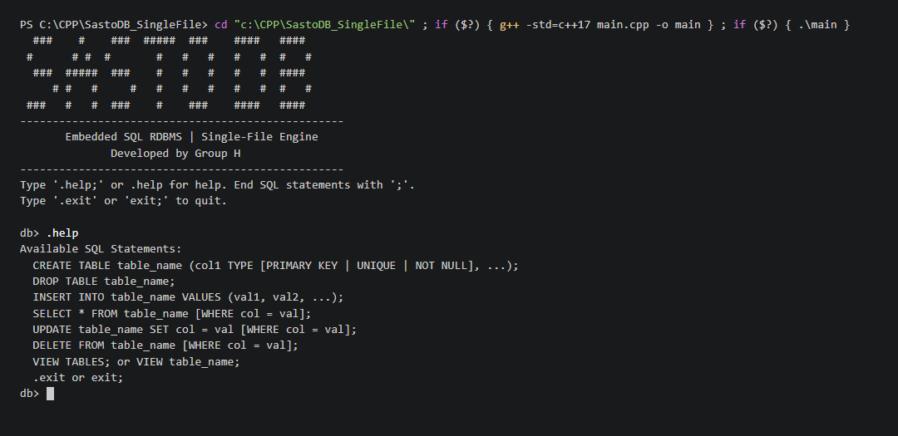
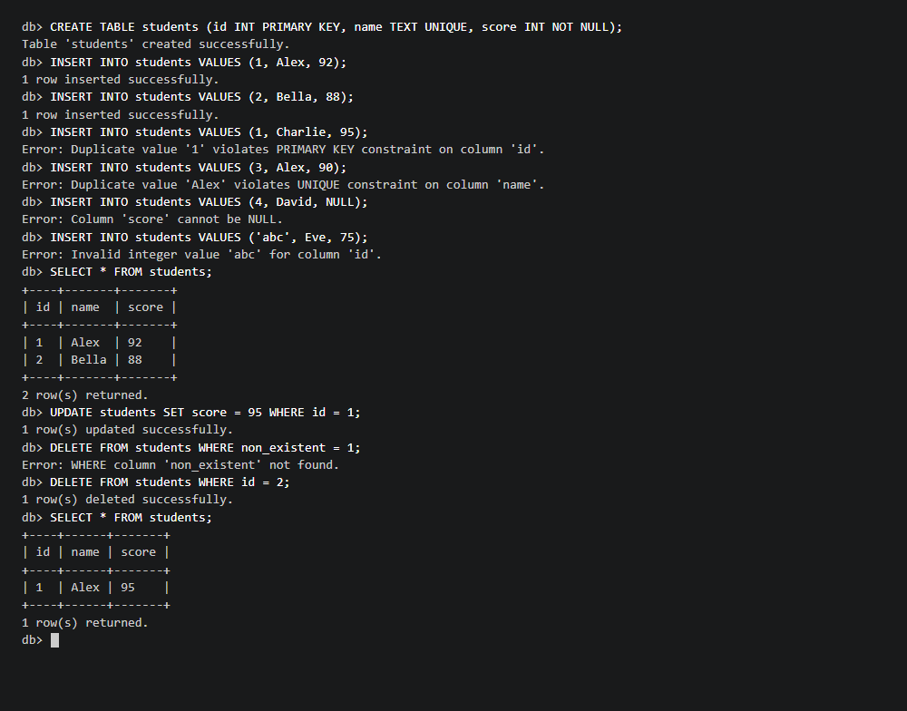
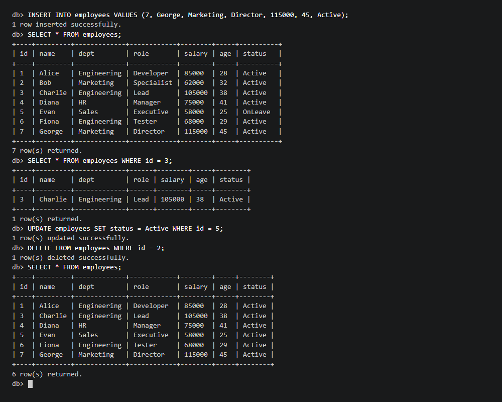
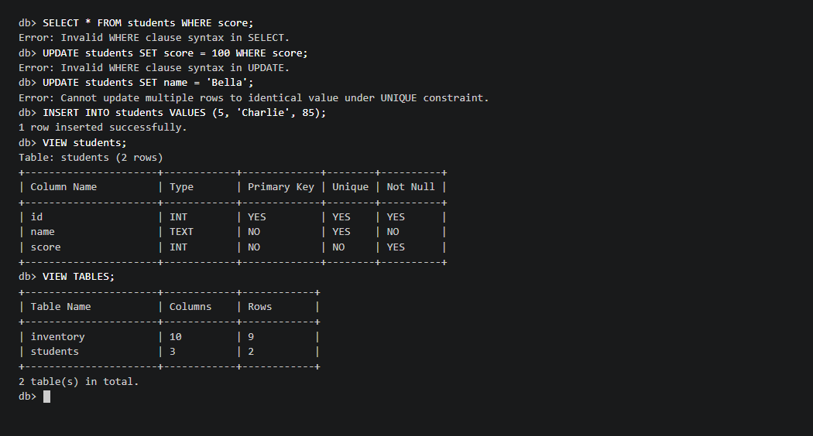

# SastoDB (Phase 1)

[](https://en.cppreference.com/w/cpp/17)
[]()
[]()

> A lightweight, embedded relational database management system (RDBMS) engine written from scratch in pure C++.

SastoDB provides an interactive SQL shell (REPL), in-memory query processing, robust constraint checking, and automatic disk persistence, built as a **streamlined, self-contained single-file engine**.

---

## Key Features

- **Pure C++ Engine**: No external dependencies or heavy frameworks; uses standard C++17.
- **Single-File Architecture**: The complete engine is contained in `src/main.cpp` (~360 lines) for zero header-inclusion issues and transparent debugging.
- **SQL DDL & DML Support**:
  - `CREATE TABLE` (with multiple column definitions and constraints)
  - `DROP TABLE`
  - `INSERT INTO` (with string quote handling and type validation)
  - `SELECT` (all columns, optional `WHERE` clause with comparison operators: `=`, `!=`, `<`, `>`, `<=`, `>=`)
  - `UPDATE` (column assignment with optional `WHERE` clause)
  - `DELETE FROM` (row removal with optional `WHERE` clause)
  - `VIEW TABLES` / `VIEW table_name` (schema and catalog inspection)
- **Constraint Enforcement**:
  - `PRIMARY KEY` (enforces uniqueness and non-null values)
  - `UNIQUE` (prevents duplicate entries across rows)
  - `NOT NULL` (prevents null values)
  - **Type Validation** (`INT`, `FLOAT`, `TEXT`)
  - **Multi-Row Protection** (prevents `UPDATE` from assigning duplicate values to unique/PK columns)
- **Formatted Tabular Output**: Aligned ASCII tables dynamically sized using `<iomanip>`.
- **Automatic Disk Persistence**: Tables and catalogs automatically save to and load from disk.

---

## Project Structure

```text
SastoDB-Phase-1/
├── src/
│   └── main.cpp            # Self-contained single-file RDBMS engine (~360 lines)
├── Test_Screenshots/       # Clean terminal-only test verification screenshots
│   ├── Screenshot_1.png    # Build, banner, and .help command
│   ├── Screenshot_2.png    # Accounts table & PK constraint check
│   ├── Screenshot_3.png    # Employees table multi-row operations & WHERE filter
│   ├── Screenshot_4.png    # Demo script pipeline (students table & constraints)
│   ├── Screenshot_5.png    # Syntax errors & schema inspection (VIEW)
│   └── Screenshot_6.png    # Range queries, dynamic CREATE/DROP, and exit
├── Demo_Script.txt         # Automated demo test script
├── DOCUMENTATION.md        # Comprehensive line-by-line & architectural documentation
├── .gitignore              # Ignores binaries (*.exe) and build artifacts
└── README.md               # Project overview and quickstart guide
```

---

## Quickstart & Build Instructions

### Prerequisites
- A C++ compiler supporting C++17 (such as GCC/MinGW or Clang).

### 1. Compile
Navigate to the `src/` directory and compile `main.cpp`:

```bash
cd src
g++ -std=c++17 -Wall main.cpp -o main
```

### 2. Run Interactively
Launch the interactive SQL shell:

```bash
# On Windows
.\main.exe

# On Linux/macOS
./main
```

### 3. Run Automated Demo Script
```powershell
Get-Content "..\Demo_Script.txt" | .\main.exe
```

---

## Screenshots & Demo

### 1. Compilation & Interactive Startup


### 2. Demo Script Pipeline (Constraints & Table Queries)


### 3. Multi-Row Operations & Filtered Queries


### 4. Syntax Validation & Schema Inspection


---

## SQL Syntax & Example Queries

### 1. Create a Table with Constraints
```sql
CREATE TABLE students (id INT PRIMARY KEY, name TEXT UNIQUE, score INT NOT NULL);
```

### 2. Insert Records
```sql
INSERT INTO students VALUES (1, 'Alex', 92);
INSERT INTO students VALUES (2, 'Bella', 88);
```

### 3. Constraint Checks in Action
```sql
-- Error: Duplicate PRIMARY KEY
INSERT INTO students VALUES (1, 'Charlie', 95);

-- Error: Duplicate UNIQUE value
INSERT INTO students VALUES (3, 'Alex', 90);

-- Error: NOT NULL constraint violation
INSERT INTO students VALUES (4, 'David', NULL);

-- Error: Invalid data type for INT column
INSERT INTO students VALUES ('abc', 'Eve', 75);
```

### 4. Query Records
```sql
-- Select all rows
SELECT * FROM students;

-- Select with WHERE condition
SELECT * FROM students WHERE id = 1;
SELECT * FROM students WHERE score >= 90;
```

### 5. Update and Delete
```sql
-- Update record
UPDATE students SET score = 95 WHERE id = 1;

-- Delete record
DELETE FROM students WHERE id = 2;
```

### 6. Inspect Database
```sql
-- View all tables in database
VIEW TABLES;

-- Inspect schema of a specific table
VIEW students;
```

### 7. Exit and Persist
```sql
.exit
```

---

## Documentation
For an in-depth line-by-line explanation of the entire engine code and file storage format, please read [DOCUMENTATION.md](DOCUMENTATION.md).

---

## License
This project is licensed under the MIT License.
